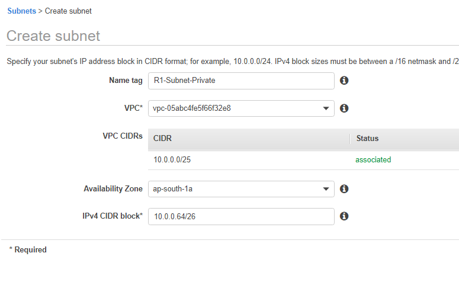
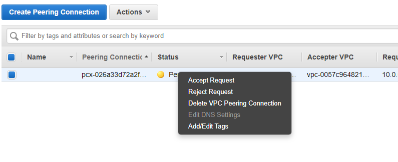

# VPC Peering

## Creating a Sample Infrastructure for Peering

> Refer Instructions with screenshots as reference

- ### Create VPC in Region-1

- ### Create Public Subnet in VPC

- ### Create Private Subnet

- ### Create Public Routing Table

- ### Create Private Routing Table

- ### Associate Public Subnet with Public Route Table

- ### Associate Private Subnet with Private Route Table

- ### Create Internet Gateway

- ### Attach Internet Gateway to VPC

- ### Add IGW To Public Routing Table

- ### Create an EC2 instance with Public Subnet

Then create a Public Security Group with default access for this Public Instance

- ### Create an EC2 instance with Private Subnet

- ### Create Private Subnet Group with access only from Public Instance

---

> Repeat the same steps above for another VPC (preferably different Region)

- Now Connect to Public Instance of EC2 in VPC 1
- Create a demo.pem file with your ec2&#39;s pem file
- Try Connecting to Private Instance in VPC 1
- If Connected, Try to Ping Private Instance in VPC 2 (It Will Fail)

---

## Lets Create VPC Peering

- Now create VPC Peering (From VPC 1 to VPC 2) Go to VPC Section and select Peering Connection, Now click on create – Give Name to Peering Connection, Select the Requester VPC, which here will be VPC – 1. Then in another VPC to peer with select the VPC-2, but if it is in another region then copy its ID and then select the region for that VPC and paste the ID. Now click on Create button

- Now a request has been forwarded to target VPC region, so open the same window of peering connection in that region and select the peering request and accept it

- Now again update the Route Tables (VPC – 1 Private Route Table) Add Subnet for VPC -2 and Target it to VPC Peering

- Now again do the same update for Route Tables (VPC – 2 Private Route Table) Add Subnet for VPC -1 and Target it to VPC Peering

- Now try to ping/connect private instance, it should work now (If it doesn&#39;t make sure to update Security Group for Private instance)

## Reference

[AWS Doc - VPC Peering](https://docs.aws.amazon.com/vpc/latest/peering/what-is-vpc-peering.html)
