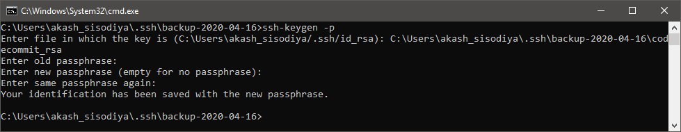

# Git

## Important Points

---

### How to configure Code Commit

AWS Official Document **URL:** [Link](https://docs.aws.amazon.com/codecommit/latest/userguide/setting-up-ssh-unixes.html)

---

### How to check if you are using ssh/https for git

Use Command `git remote -v`

```cmd
> git remote -v
origin  ssh://SSHKEYID@git-codecommit.your_region.amazonaws.com/v1/repos/YOUR-REPO (fetch)
origin  ssh://SSHKEYID@git-codecommit.your_region.amazonaws.com/v1/repos/YOUR-REPO (push)
```

---

### How to remove passphrase from your key in order to stop GIT from asking password again and again

Just go to .ssh folder and run this command `ssh-keygen -p`

```cmd
C:\Users\akash_sisodiya\.ssh>ssh-keygen -p
Enter file in which the key is (C:\Users\akash_sisodiya/.ssh/id_rsa): C:\Users\akash_sisodiya\.ssh\codecommit_rsa
Enter old passphrase: <EnterYourCurrentPasswordHere>
Enter new passphrase (empty for no passphrase): <Leave It Blank and Press Enter>
Enter same passphrase again: <Leave It Blank and Press Enter>
Your identification has been saved with the new passphrase.
```



---

## Basic Git Commands

Command to set username and email, need to be done onetime only. *(user.name is also the author name)*

```powershell
git config --global user.name "Akashsingh Sisodiya"
git config --global user.email "aasisodiya@github.com"
```

To check above changes run below commands

```powershell
git config user.name
# Akashsingh Sisodiya
git config user.email
# aasisodiya@github.com
```

Use below command to check all the other options you can edit in config

```powershell
git config --list
# core.symlinks=false
# core.autocrlf=true
# core.fscache=true
# color.diff=auto
# color.status=auto
# color.branch=auto
# color.interactive=true
# help.format=html & so on....
# (END) press q to terminate command
```

Command to create a repository, one time command, created by admin user

```powershell
git init
# Initialized empty Git repository in C:/Users/akash/Documents/GitHub/temp/.git/
```

Command to add the file to staging area

```powershell
# Command to add single file
git add file1.txt
# Add all files
git add .
# OR
git add *
# Add all files with specific extension
git add *.java
```

Command to remove the file from staging area

```powershell
git restore --staged *
git restore --staged <filename>
```

Command to check current status (green color means file is in staging area)

```powershell
git status
```

Command to commit changes *(You need to make sure to add files to staging that you want to commit)*

```powershell
git commit -m "message, present tense, specific to changes made"
```

Command to add and commit changes at same time

```powershell
git commit -am "message"
```

> If the file is newly created, you may have to use add and commit individually.

Command to check what you have done till now

```powershell
git log
# to display only message
git log --oneline
# to display n recent commit
git log --oneline -2
# to display log after date ddmmyy
git log --since=1-01-2018
# to display log before date ddmmyy
git log --until=2-01-2018
# to display log using author
git log --author="Akash Sisodiya"
# to display log using message
git log --grep="case sensitive message"
```

Command to get help on specific git command

```powershell
git <somecommand> --help
```

> To ignore the files we use .gitignore, and you may also want to track .gitignore

Command to check a difference with your current changes

```powershell
# Command to check a difference with your current changes
git diff
# Command to check changes between staging area and working directory
git diff --staged
```

Command to add deleted file into staging area

```powershell
git rm deletedfile.txt
```

> On renaming it will show that the file is deleted and another new file is added. But when we use `git add .` it will show renamed.

Command to check how the file looked when it was commited or checkout specific commit

```powershell
# Jumping to a commit
git checkout shacode
# Going back to master(original/initial)
git checkout master
# Switch between version/branches
git checkout branch_name
```

Command to undo changes - `git revert` vs `git reset`

***RESET is something that you should avoid at all cost.***

```powershell
git reset --hard <commit id>
git push -f
```

Soft Reset Vs Hard Reset Vs Mixed Reset Vs Keep Reset

- **Soft:** When using `git reset --soft HEAD~1` you will remove the last commit from the current branch, but the file changes will stay in your working tree. Also the changes will stay on your index, so following with a git commit will create a commit with the exact same changes as the commit you "removed" before.
- **Mixed:** This is the default mode and quite similar to soft. When "removing" a commit with `git reset HEAD~1` you will still keep the changes in your working tree but not on the index; so if you want to "redo" the commit, you will have to add the changes (git add) before commiting.
- **Hard:** When using `git reset --hard HEAD~1` you will lose all uncommited changes in addition to the changes introduced in the last commit. The changes won't stay in your working tree so doing a git status command will tell you that you don't have any changes in your repository.
  _Tread carefully with this one. If you accidentally remove uncommited changes which were never tracked by git (speak: committed or at least added to the index), you have no way of getting them back using git._
- **Keep:** `git reset --keep HEAD~1` is an interesting and useful one. It only resets the files which are different between the current HEAD and the given commit. It aborts the reset if anyone of these files has uncommited changes. It's basically acts as a safer version of hard. This mode is particularly useful when you have a bunch of changes and want to switch to a different branch without losing these changes - for example when you started to work on the wrong branch.

> When doing git reset to remove a commit the commit isn't really lost, there just is no reference pointing to it or any of it's children. You can still recover a commit which was "deleted" with git reset by finding it's SHA-1 key, for example with a command such as git reflog.

REVERT is nothing but rewriting the commit with undo

```powershell
git revert head
```

Command to create new branch

```powershell
git branch branch_name
```

Command to register a branch on remote repository ([But why?](https://stackoverflow.com/questions/37770467/why-do-i-have-to-git-push-set-upstream-origin-branch))

```powershell
git push --set-upstream origin branch_name
```

Command to view Branches

```powershell
# To view active and local branches
git branch
# To view active and all branches - remote and local
git branch -r
```

Command to merge branch to master

```powershell
# For merging , switch to master
git checkout master
# Now you can merge the branch
git merge branch-name
# this merge is called as fast forward merge
git merge --abort
# use abort in case you run into conflict and don't want to resolve it just yet
```

Command to delete the branch

```powershell
# Deleting branch (master can not be deleted)
git branch -d branch-name
# If branch is not merged, above command will not allow you to delete the branch
git branch -D branch-name
# Above command will forcefully delete the branch whether or not changes have been merged
git push origin --delete branch-name
# Above command will delete the branch from remote
```

Command to create a branch and checkout at the same time

```powershell
git checkout -b branch-name
```

<!-- //message state
Administrator@JAVA MINGW64 /c/DemoGitTest (master|MERGING) -->

Command to get decorated log

```powershell
git log --decorate
```

Command to REBASE

```powershell
# sit on the branch and use rebase
git rebase master
# move to master
git merge branch-name
```

> [Git Tagging](https://www.atlassian.com/git/tutorials/inspecting-a-repository/git-tag)

Command for [Git Stashing](https://git-scm.com/docs/git-stash)

```powershell
# To record the current state of the working directory and the index, but want to go back to a clean working directory.
git stash
# Remove all the stash entries
git stash clear
# List the stash entries that you currently have
git list
```

Command for Viewing git remote configurations

```powershell
# List the remote connections you have to other repositories.
git remote
# Same as the above command, but include the URL of each connection.
git remote -v
```

Git [Remote](https://www.atlassian.com/git/tutorials/syncing)

```powershell
# Create a new connection to a remote repository. After adding a remote, you’ll be able to use <name> as a convenient shortcut for <url> in other Git commands.
git remote add <name> <url>
# Remove the connection to the remote repository called <name>.
git remote rm <name>
# Rename a remote connection from <old-name> to <new-name>.
git remote rename <old-name> <new-name>
```

```powershell
git push -u origin master//one time command(-u)

# config setting
git config --global http.proxy "http://custom.proxy.co.in:8080"

# not merge , but want to know what we are upto?
git fetch
git merge

# pull is a combination of fetch and merge
git pull

# Cloning a repository, come out of your own main repository and make a new directory
git clone URL //one time command
```

## Reference

- [Atlassian Git Tutorials](https://www.atlassian.com/git/tutorials)
- [Git SCM](https://git-scm.com/doc)
- [Types of Git Reset](https://stackoverflow.com/questions/24568936/what-is-difference-between-git-reset-hard-head1-and-git-reset-soft-head)
