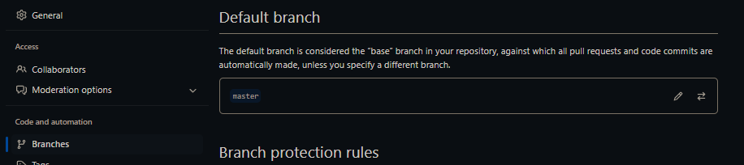

# Git

[](https://visitorbadge.io/status?path=aasisodiya.general.git)

- [Git](#git)
  - [Important Points](#important-points)
    - [How to configure Code Commit](#how-to-configure-code-commit)
    - [How to check if you are using ssh/https for git](#how-to-check-if-you-are-using-sshhttps-for-git)
    - [How to remove passphrase from your key in order to stop GIT from asking password again and again](#how-to-remove-passphrase-from-your-key-in-order-to-stop-git-from-asking-password-again-and-again)
  - [Basic Git Commands](#basic-git-commands)
    - [Command to create a repository](#command-to-create-a-repository)
    - [Command to add the file to staging area](#command-to-add-the-file-to-staging-area)
    - [Command to remove the file from staging area](#command-to-remove-the-file-from-staging-area)
    - [Command to check current status](#command-to-check-current-status)
    - [Command to commit changes](#command-to-commit-changes)
    - [Command to add and commit changes at same time](#command-to-add-and-commit-changes-at-same-time)
    - [Command to check what you have done till now](#command-to-check-what-you-have-done-till-now)
    - [Command to get help on specific git command](#command-to-get-help-on-specific-git-command)
    - [Command to check a difference with your current changes](#command-to-check-a-difference-with-your-current-changes)
    - [Command to add deleted file into staging area](#command-to-add-deleted-file-into-staging-area)
    - [Command to check how the file looked when it was committed or checkout specific commit](#command-to-check-how-the-file-looked-when-it-was-committed-or-checkout-specific-commit)
    - [Command to undo changes - `git revert` vs `git reset`](#command-to-undo-changes---git-revert-vs-git-reset)
    - [Soft Reset Vs Hard Reset Vs Mixed Reset Vs Keep Reset](#soft-reset-vs-hard-reset-vs-mixed-reset-vs-keep-reset)
    - [Command to reset branch to the state of remote branch](#command-to-reset-branch-to-the-state-of-remote-branch)
    - [Command to create new branch](#command-to-create-new-branch)
    - [Command to view Branches](#command-to-view-branches)
    - [Command to merge branch to master](#command-to-merge-branch-to-master)
    - [Command to delete the branch](#command-to-delete-the-branch)
    - [Command to create a branch and checkout at the same time](#command-to-create-a-branch-and-checkout-at-the-same-time)
    - [Command to get decorated log](#command-to-get-decorated-log)
    - [Command to REBASE](#command-to-rebase)
    - [Command to create Git Tags](#command-to-create-git-tags)
    - [Command to Delete Git Tag](#command-to-delete-git-tag)
    - [Command for Git Stashing](#command-for-git-stashing)
    - [Command for Viewing git remote configurations](#command-for-viewing-git-remote-configurations)
    - [Git Remote](#git-remote)
  - [Renaming Default/Main/Master/Base Branch](#renaming-defaultmainmasterbase-branch)
  - [Renaming A Branch](#renaming-a-branch)
  - [Commit Signing in Git](#commit-signing-in-git)
    - [Generating a GPG key](#generating-a-gpg-key)
  - [Large File System](#large-file-system)
  - [Troubleshooting](#troubleshooting)
  - [Reference](#reference)

## Important Points

---

### How to configure Code Commit

AWS Official Document **URL:** [Link](https://docs.aws.amazon.com/codecommit/latest/userguide/setting-up-ssh-unixes.html)

---

### How to check if you are using ssh/https for git

Use Command `git remote -v`

```cmd
> git remote -v
origin  ssh://SSHKEYID@git-codecommit.your_region.amazonaws.com/v1/repos/YOUR-REPO (fetch)
origin  ssh://SSHKEYID@git-codecommit.your_region.amazonaws.com/v1/repos/YOUR-REPO (push)
```

---

### How to remove passphrase from your key in order to stop GIT from asking password again and again

Just go to .ssh folder and run this command `ssh-keygen -p`

```cmd
C:\Users\akash_sisodiya\.ssh>ssh-keygen -p
Enter file in which the key is (C:\Users\akash_sisodiya/.ssh/id_rsa): C:\Users\akash_sisodiya\.ssh\codecommit_rsa
Enter old passphrase: <EnterYourCurrentPasswordHere>
Enter new passphrase (empty for no passphrase): <Leave It Blank and Press Enter>
Enter same passphrase again: <Leave It Blank and Press Enter>
Your identification has been saved with the new passphrase.
```


---

## Basic Git Commands

Command to set username and email, need to be done onetime only. _(user.name is also the author name)_

```powershell
git config --global user.name "Akashsingh Sisodiya"
git config --global user.email "aasisodiya@github.com"
```

To check above changes run below commands

```powershell
git config user.name
# Akashsingh Sisodiya
git config user.email
# aasisodiya@github.com
```

Use below command to check all the other options you can edit in config

```powershell
git config --list
# core.symlinks=false
# core.autocrlf=true
# core.fscache=true
# color.diff=auto
# color.status=auto
# color.branch=auto
# color.interactive=true
# help.format=html & so on....
# (END) press q to terminate command
```

### Command to create a repository

It is a one time command, and repo is created by admin user

```powershell
git init
# Initialized empty Git repository in C:/Users/akash/Documents/GitHub/temp/.git/
```

### Command to add the file to staging area

```powershell
# Command to add single file
git add file1.txt
# Add all files
git add .
# OR
git add *
# Add all files with specific extension
git add *.java
```

### Command to remove the file from staging area

```powershell
git restore --staged *
git restore --staged <filename>
```

### Command to check current status

Here green color means file is in staging area

```powershell
git status
```

### Command to commit changes

> _(You need to make sure to add files to staging that you want to commit)_

```powershell
git commit -m "message, present tense, specific to changes made"
```

### Command to add and commit changes at same time

```powershell
git commit -am "message"
```

> If the file is newly created, you may have to use add and commit individually.

### Command to check what you have done till now

```powershell
git log
# to display only message
git log --oneline
# to display n recent commit
git log --oneline -2
# to display log after date ddmmyy
git log --since=1-01-2018
# to display log before date ddmmyy
git log --until=2-01-2018
# to display log using author
git log --author="Akash Sisodiya"
# to display log using message
git log --grep="case sensitive message"
```

### Command to get help on specific git command

```powershell
git <somecommand> --help
```

> To ignore the files we use .gitignore, and you may also want to track .gitignore

### Command to check a difference with your current changes

```powershell
# Command to check a difference with your current changes
git diff
# Command to check changes between staging area and working directory
git diff --staged
```

### Command to add deleted file into staging area

```powershell
git rm deletedfile.txt
```

> On renaming it will show that the file is deleted and another new file is added. But when we use `git add .` it will show renamed.

### Command to check how the file looked when it was committed or checkout specific commit

```powershell
# Jumping to a commit
git checkout shacode
# Going back to master(original/initial)
git checkout master
# Switch between version/branches
git checkout branch_name
```

### Command to undo changes - `git revert` vs `git reset`

**_RESET is something that you should avoid at all cost._**

```powershell
git reset --hard <commit id>
git push -f
```

### Soft Reset Vs Hard Reset Vs Mixed Reset Vs Keep Reset

- **Soft:** When using `git reset --soft HEAD~1` you will remove the last commit from the current branch, but the file changes will stay in your working tree. Also the changes will stay on your index, so following with a git commit will create a commit with the exact same changes as the commit you "removed" before.
- **Mixed:** This is the default mode and quite similar to soft. When "removing" a commit with `git reset HEAD~1` you will still keep the changes in your working tree but not on the index; so if you want to "redo" the commit, you will have to add the changes (git add) before committing.
- **Hard:** When using `git reset --hard HEAD~1` you will lose all uncommitted changes in addition to the changes introduced in the last commit. The changes won't stay in your working tree so doing a git status command will tell you that you don't have any changes in your repository.
  _Tread carefully with this one. If you accidentally remove uncommitted changes which were never tracked by git (speak: committed or at least added to the index), you have no way of getting them back using git._
- **Keep:** `git reset --keep HEAD~1` is an interesting and useful one. It only resets the files which are different between the current HEAD and the given commit. It aborts the reset if anyone of these files has uncommitted changes. It's basically acts as a safer version of hard. This mode is particularly useful when you have a bunch of changes and want to switch to a different branch without losing these changes - for example when you started to work on the wrong branch.

> When doing git reset to remove a commit the commit isn't really lost, there just is no reference pointing to it or any of it's children. You can still recover a commit which was "deleted" with git reset by finding it's SHA-1 key, for example with a command such as git reflog.

> REVERT is nothing but rewriting the commit with undo

```powershell
git revert head
```

```powershell
git reset --hard origin/<branch_name>
```

Above command will help you reset the local branch to the state of the remote branch. That is if you have any commits that only you can see or any changes on your local, then on running above command it will delete all that and align your branch to the same commit as that of the remote branch. (This will delete all your local changes forever!)

### Command to reset branch to the state of remote branch

```bash
git reset --hard origin/feature
git clean -f
```

If you `reset --hard` , it will make your local code and local history be just like it was at that commit. But if you wanted to push this to someone else who has the new history, it would fail:

```bash
git reset --hard <commit_id>
```

And if you `reset --soft`, it will move your HEAD to where they were , but leave your local files etc. the same:

```bash
git reset --soft <commit_id>
```

```bash
git reset --hard [previous commit SHA id here]
git push origin [branch name] -f
```

### Command to create new branch

```powershell
git branch branch_name
```

Command to register a branch on remote repository ([But why?](https://stackoverflow.com/questions/37770467/why-do-i-have-to-git-push-set-upstream-origin-branch)) Simply creating a branch on local won't make it available for other people to use. So you will have to push the branch to remote as well. Use below command to push branch to remote

```powershell
git push --set-upstream origin branch_name
```

### Command to view Branches

```powershell
# To view active and local branches
git branch
# To view active and all branches - remote and local
git branch -r
```

### Command to merge branch to master

```powershell
# For merging , switch to master
git checkout master
# Now you can merge the branch
git merge branch-name
# this merge is called as fast forward merge
git merge --abort
# use abort in case you run into conflict and don't want to resolve it just yet
```

### Command to delete the branch

```powershell
# Deleting branch (master can not be deleted)
git branch -d branch-name
# If branch is not merged, above command will not allow you to delete the branch
git branch -D branch-name
# Above command will forcefully delete the branch whether or not changes have been merged
git push origin --delete branch-name
# Above command will delete the branch from remote
git push -d origin feature-vs-code
# Above command will delete the branch from remote
```

### Command to create a branch and checkout at the same time

```powershell
git checkout -b branch-name
```

<!-- //message state
Administrator@JAVA MINGW64 /c/DemoGitTest (master|MERGING) -->

### Command to get decorated log

```powershell
git log --decorate
```

### Command to REBASE

```powershell
# sit on the branch and use rebase
git rebase master
# move to master
git merge branch-name
```

### Command to create Git Tags

```bash
git tag v1.0.0-beta COMMIT_ID
git tag featureName/v1.0.0-beta COMMIT_ID
git push origin v1.0.0-beta
git push origin featureName/v1.0.0-beta
```

### Command to Delete Git Tag

```cmd
git tag -d v1.0.0-test
git push --delete origin v1.0.0-test
git tag -d <tag_name>
git push --delete origin <tag_name>
```

> [Git Tagging](https://www.atlassian.com/git/tutorials/inspecting-a-repository/git-tag)

### Command for [Git Stashing](https://git-scm.com/docs/git-stash)

```powershell
# To record the current state of the working directory and the index, but want to go back to a clean working directory.
git stash
# Remove all the stash entries
git stash clear
# List the stash entries that you currently have
git list
```

### Command for Viewing git remote configurations

```powershell
# List the remote connections you have to other repositories.
git remote
# Same as the above command, but include the URL of each connection.
git remote -v
```

### Git [Remote](https://www.atlassian.com/git/tutorials/syncing)

```powershell
# Create a new connection to a remote repository. After adding a remote, you’ll be able to use <name> as a convenient shortcut for <url> in other Git commands.
git remote add <name> <url>
# Remove the connection to the remote repository called <name>.
git remote rm <name>
# Rename a remote connection from <old-name> to <new-name>.
git remote rename <old-name> <new-name>
```

```powershell
git push -u origin master
#one time command(-u)

# config setting
git config --global http.proxy "http://custom.proxy.co.in:8080"

# not merge , but want to know what we are up to?
git fetch
git merge

# pull is a combination of fetch and merge
git pull

# get all of the changes made across all the branches to your local machine.
git pull --all

# Cloning a repository, come out of your own main repository and make a new directory
git clone URL //one time command
```

---

## Renaming Default/Main/Master/Base Branch

For Github, first go to Repo `Settings`, then go to `Branches` under `Code and Automation Settings`. Now under Default branch rename the branch as shown below.



After which you will get a following message:

```bash
The default branch has been renamed!
practice is now named main

If you have a local clone, you can update it by running the following commands.

git branch -m practice main
git fetch origin
git branch -u origin/main main
git remote set-head origin -a
```

Follow the above instructions on your local and you are done.

---

## Renaming A Branch

Renaming Local Branch:

```bash
# Current branch you want to rename:
git branch -m new-branch-name

# Different branch you want to rename:
git branch -m old-branch-name new-branch-name
```

Renaming and Deleting old-branch-name from Remote and push new-branch-name

```bash
git push origin :old-name new-name
```

Now Reset the upstream for the new-branch-name:

```bash
# First checkout the branch and then run:
git push origin -u new-branch-name
```

```bash
# Switch to the local branch you want to rename
git checkout <old_name>

# Rename the local branch
git branch -m <new_name>

# Push the <new_name> local branch and reset the upstream branch
git push origin -u <new_name>

# Delete the <old_name> remote branch
git push origin --delete <old_name>
```

---

## Commit Signing in Git

On Github, when you commit any code your name appears as an Author. Considering that its set in the git config. Now if you want to you can change the email and username and hence show the commit as someone's elses commit. Now That's something which can impact your code repository, if it's being handled by multiple users. Now on Github we have "Verified" Tag on commits. This is possible due to Commit Signing in Git. Commit Signing helps you to prove that you were indeed the author. It also helps to ensure that the commit is made by a verified user. Its really important for you to make sure that the commits are verified during a PR review. This is a major Security Step. You can impersonate anyone's name but it's impossible for anyone to copy your signature. So make it a habit of signing the commit.

Git commits are trust-based, so it'll assume you put in your real email and name. You can then commit and push to remote providers like GitHub and GitLab with the details provided.

If commits required authentication by default, it'd be impossible to migrate or mirror projects to other platforms. The commit history will include former employees, dead users, inactive accounts, or email addresses that aren't on other platforms.

GNU Privacy Guard (GnuPG or GPG) allows you to create cryptographic asymmetric key pairs that can be used for the encryption and signing of data. They consist of a public and private key.

> **Note**: GitHub Desktop does not support commit signing.

To configure your Git client to sign commits by default for a local repository, in Git versions 2.0.0 and above, run

```bash
git config commit.gpgsign true
```

To sign all commits by default in any local repository on your computer, run

```bash
git config --global commit.gpgsign true
```

To store your GPG key passphrase so you don't have to enter it every time you sign a commit, we recommend using the following tools:

- For Mac users, the [GPG Suite](https://gpgtools.org/) allows you to store your GPG key passphrase in the Mac OS Keychain.
- For Windows users, the [Gpg4win](https://www.gpg4win.org/) integrates with other Windows tools.

You can also manually configure [gpg-agent](http://linux.die.net/man/1/gpg-agent) to save your GPG key passphrase, but this doesn't integrate with Mac OS Keychain like ssh-agent and requires more setup.

Checking for existing GPG keys - Open Git Bash

```bash
gpg --list-secret-keys --keyid-format=long
```

### Generating a GPG key

> Note: On Github - Before generating a new GPG key, make sure you've verified your email address. If you haven't verified your email address, you won't be able to sign commits and tags with GPG.

1. Download and install [the GPG command line tools](https://www.gnupg.org/download/) for your operating system. We generally recommend installing the latest version for your operating system.
2. Open Git Bash.
3. Generate a GPG key pair. Since there are multiple versions of GPG, you may need to consult the relevant man page to find the appropriate key generation command. Your key must use RSA.

    ```bash
    gpg --full-generate-key
    ```

4. At the prompt, specify the kind of key you want, or press `Enter` to accept the default.
5. At the prompt, specify the key size you want, or press `Enter` to accept the default. Your key must be at least `4096` bits.
6. Enter the length of time the key should be valid. Press `Enter` to specify the default selection, indicating that the key doesn't expire.
7. Verify that your selections are correct.
8. Enter your user ID information.
    > Note: When asked to enter your email address, ensure that you enter the verified email address for your GitHub account. To keep your email address private, use your GitHub-provided no-reply email address.
9. Type a secure passphrase.
10. Use the `gpg --list-secret-keys --keyid-format=long` command to list the long form of the GPG keys for which you have both a public and private key. A private key is required for signing commits or tags.

    ```bash
    gpg --list-secret-keys --keyid-format=long
    ```

    > Note: Some GPG installations on Linux may require you to use `gpg2 --list-keys --keyid-format LONG` to view a list of your existing keys instead. In this case you will also need to configure Git to use `gpg2` by running `git config --global gpg.program gpg2`.

11. From the list of GPG keys, copy the long form of the GPG key ID you'd like to use. In this example, the GPG key ID is `3AA5C34371567BD2`:

    ```bash
    $ gpg --list-secret-keys --keyid-format=long
    /Users/hubot/.gnupg/secring.gpg
    ------------------------------------
    sec   4096R/3AA5C34371567BD2 2016-03-10 [expires: 2017-03-10]
    uid                          Hubot
    ssb   4096R/42B317FD4BA89E7A 2016-03-10
    ```

12. Paste the text below, substituting in the GPG key ID you'd like to use. In this example, the GPG key ID is `3AA5C34371567BD2`:

    ```bash
    $ gpg --armor --export 3AA5C34371567BD2
    # Prints the GPG key ID, in ASCII armor format
    ```

13. Copy your GPG key, beginning with `-----BEGIN PGP PUBLIC KEY BLOCK-----` and ending with `-----END PGP PUBLIC KEY BLOCK-----`.
14. Add the GPG key to your GitHub account.
15. To set your GPG signing key in Git, paste the text below, substituting in the GPG key ID you'd like to use. In this example, the GPG key ID is `3AA5C34371567BD2`:

    ```bash
    git config --global user.signingkey 3AA5C34371567BD2
    git config --global commit.gpgsign true
    ```

    > For VS Code you can go to settings and search `gpg` and enable commit signing

Now when you commit the changes it might ask you for passphrase so enter the same that you used for the one while creating the GPG key

> Some really good article on Commit Signing for reference: [Link1](https://docs.github.com/en/github/authenticating-to-github/managing-commit-signature-verification/signing-commits), [Link2](https://withblue.ink/2020/05/17/how-and-why-to-sign-git-commits.html) and [Link3](https://www.freecodecamp.org/news/what-is-commit-signing-in-git/amp/)

---

## Large File System

Discovered LFS after encountering below error:

```ps
C:\Users\akash\Documents\GitHub\design>git push
Enumerating objects: 226, done.
Counting objects: 100% (226/226), done.
Delta compression using up to 4 threads
Compressing objects: 100% (225/225), done.
Writing objects: 100% (225/225), 173.14 MiB | 4.67 MiB/s, done.
Total 225 (delta 17), reused 0 (delta 0)
remote: Resolving deltas: 100% (17/17), done.
remote: warning: See http://git.io/iEPt8g for more information.
remote: warning: File behance/ADOBE ILLUSTRATOR/SISAI - SISAILOGO.ai is 66.66 MB; this is larger than GitHub's recommended maximum file size of 50.00 MB
remote: warning: GH001: Large files detected. You may want to try Git Large File Storage - https://git-lfs.github.com.
To https://github.com/aasisodiya/design.git
   3787a78..a3bf7a0  main -> main

C:\Users\akash\Documents\GitHub\design>
```

- GitHub's recommended maximum file size is `50.00 MB`

---

## Troubleshooting

- You get following error on Github Desktop, when you are committing without password

  ```ps
  error: cannot spawn gpg: No such file or directory
  error: gpg failed to sign the data
  fatal: failed to write commit object
  ```

  To resolve this issue, try committing through command-line

---

## Reference

- [Atlassian Git Tutorials](https://www.atlassian.com/git/tutorials)
- [Git SCM](https://git-scm.com/doc)
- [Types of Git Reset](https://stackoverflow.com/questions/24568936/what-is-difference-between-git-reset-hard-head1-and-git-reset-soft-head)

[](https://visitorbadge.io/status?path=aasisodiya.general)
