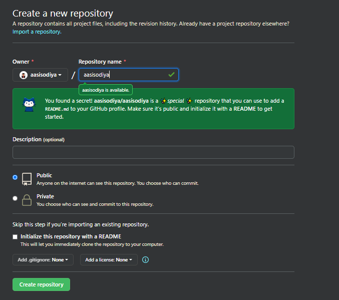
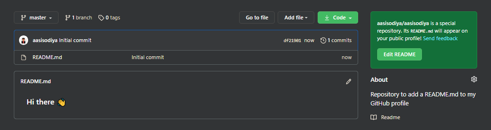

# GitHub

## Creating a GitHub (README.md) Profile

1. Create a New Repository



Take above image as reference. You need to create a repository with same name as your github username. Which in my case is `aasisodiya`. As soon as you enter the correct username you will receive a message from github as shown in above image. Give it a description and strictly keep it Public else it won't work. Followed by Select Initialize this repository with a README. Then click on create repository. Voila! and you are done.

You will be able to see a new repository with your account name. Below is the image of my repository.



Now lets get to work. As you can see this default template is very basic. Hi there :wave: !? So you will have to customize it to suite your profile.

Below are some interesting things you can add to your README.md file

### Badges

For Adding Badges you can use [https://shields.io/](https://shields.io/category/social/). Sample code is given below with the expected output below it.

```md
[](https://www.linkedin.com/in/aasisodiya/)
[](https://medium.com/@aasisodiya)
[](https://twitter.com/aasisodiya)

```

[](https://www.linkedin.com/in/aasisodiya/)
[](https://medium.com/@aasisodiya)
[](https://twitter.com/aasisodiya)


### Github Stats

This is really cool stuff, so just try it yourself.

```md

[](https://aasisodiya.github.io/)
[](https://aasisodiya.github.io/)
[](https://aasisodiya.github.io/)
```


[](https://aasisodiya.github.io/)

Below code helps you to display - Total Contributions, Current Streak and Longest Streak and Wakatime Profile

```md
[](#)

Below code is for Wakatime Profile

[](#)
```

[](#)

### Github Repository Cards

Below code helps you to insert your repository card in Markdown

```md
[](https://aasisodiya.github.io/)
```

Below are some of my repostiories

[](https://aasisodiya.github.io/)

[](https://aasisodiya.github.io/)

[](https://aasisodiya.github.io/)

### Github Visits

Below code helps you to track the visitors count and also provide a follow button

```md
[](https://github.com/aasisodiya) [](https://github.com/aasisodiya?tab=followers)
```

[](https://github.com/aasisodiya) [](https://github.com/aasisodiya?tab=followers)

---


## Reference

- [Managing your profile README](https://docs.github.com/en/github/setting-up-and-managing-your-github-profile/managing-your-profile-readme#about-your-profile-readme)
- [Basic writing and formatting syntax](https://docs.github.com/en/github/writing-on-github/basic-writing-and-formatting-syntax)
- [Complete list of github markdown emoji markup](https://gist.github.com/rxaviers/7360908)
- [Visitor Badge](https://visitor-badge.laobi.icu/#)
