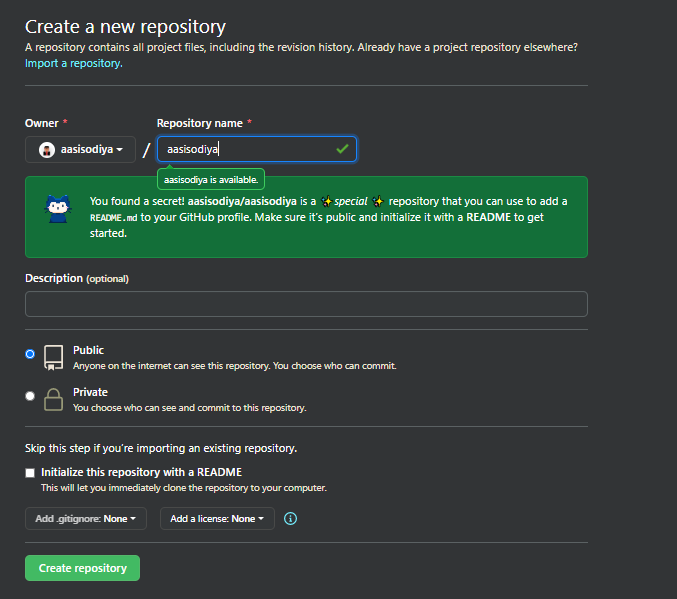

# Creating a GitHub (README.md) Profile

[](https://visitorbadge.io/status?path=aasisodiya.general.githubprofile)

## Create a New Repository



Take above image as reference. You need to create a repository with same name as your github username. Which in my case is `aasisodiya`. As soon as you enter the correct username you will receive a message from github as shown in above image. Give it a description and strictly keep it Public else it won't work. Followed by Select Initialize this repository with a README. Then click on create repository. Voila! and you are done.

You will be able to see a new repository with your account name. Below is the image of my repository.


Now lets get to work. As you can see this default template is very basic. `Hi there 👋` !? So you will have to customize it to suite your profile.

Below are some interesting things you can add to your README.md file

> **Note:** You will have to replace user specific info in below code with your own data. For ex. `aasisodiya` will get replaced with `your_profile_name`.

## Badges

|Code|Output|
|-|-|
|``<br>set LABEL=label, MESSAGE=message and COLOR=orange||
|``<br>set LABEL=label, MESSAGE=message and COLOR=orange||
|``<br>set LABEL=label, MESSAGE=message, COLOR=ffa500, style are of 5 types given below, logo can be chosen from link below, logoColor=violet, logoWidth=30 and labelColor=black||

---

```md

```

|Parameter|Description|
|-|-|
|Alternate Text|`Alternate Text` is displayed when image fails to load|
|LABEL|`LABEL` is the left side of the badge|
|MESSAGE|`MESSAGE` is the right side of the badge|
|COLOR|`COLOR` is the background color of right side|
|style|`style` is the look of the badge (details given below)|
|logo|`logo` is the name of the company you want to display the logo for|
|logoColor|`logoColor` is the color of the logo|
|logoWidth|`logoWidth` is the width of the logo|
|labelColor|`labelColor` is the color of the left side of the badge|

### Values for `style` that you can use in above code

|Style|Output|
|-|-|
|plastic||
|flat||
|flat-square||
|for-the-badge||
|social||

> For Logo visit this link [Logo List](https://simpleicons.org/)

|Badge Type|Output|Code|
|-|-|-|
|With Label||``|
|Without Label||``|

---

## Github Specific Badges

|Output|Code|
|-|-|
||``|
||``|
||``|
||``|
||``|
||``|
||``|
||``|
||``|
||``|

## Social Media Badges

|Output|Code|
|-|-|
||``|

## Visitor Badge

|Output|Code|
|-|-|
||``|
||``|

---

## Creating a Collapsible Div

<details>
<summary>Title</summary>
<pre>Content</pre>
</details>

You can generate a collapsible div by using below code

```html
<details>
<summary>Title</summary>
<pre>Content</pre>
</details>
```

---

## Github Profile Trophy


You can show a bunch of trophy for your github profile using below code. For Details visit this [link](https://github.com/ryo-ma/github-profile-trophy)

```md

```

## Github Stats


Below code will help you display your github stats

```md

```

## Github Repo


Below code helps you to insert your repository card in Markdown

```md

```

## Github Most Used Languages


Below code will help you display your Most Used Languages

```md

```


Below code will help you display your Most Used Languages but in compact way

```md

```

## Github Streak


You can display your streak in Github using below code

```md

```

## Github Skyline

Create a 3D model of your Github Contributions into a Skyline using [GitHub Skyline](https://skyline.github.com/)

Sample of 3D model will look like the one given below


## Github Profile Visitor Counter (Hits)


As shown above, below code will help you display how many visitors are viewing your Github, Website, Notion.

```md

```

## Reference

- [Shields.io](https://shields.io/)
- [SimpleIcons.org](https://simpleicons.org/)
- [Waka Readme](https://github.com/marketplace/actions/waka-readme)
- [Managing your profile README](https://docs.github.com/en/github/setting-up-and-managing-your-github-profile/managing-your-profile-readme#about-your-profile-readme)
- [Basic writing and formatting syntax](https://docs.github.com/en/github/writing-on-github/basic-writing-and-formatting-syntax)
- [Complete list of github markdown emoji markup](https://gist.github.com/rxaviers/7360908)
- [Visitor Badge](https://visitor-badge.laobi.icu/#)
- [GitHub Skyline](https://skyline.github.com/)
- [Hits](https://hits.seeyoufarm.com/)

[](https://visitorbadge.io/status?path=aasisodiya.general)
