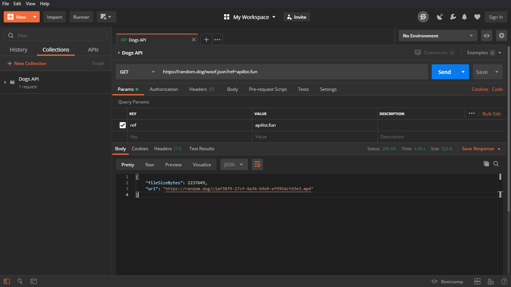
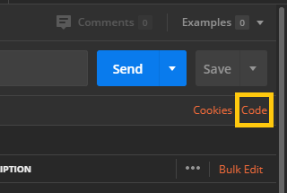
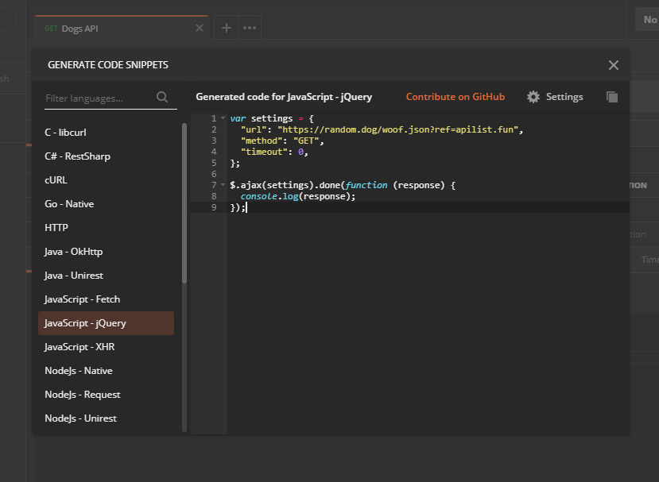

# Postman's Features

## Using Postman to Code

Postman has a very useful feature that lets you code API calls in any Language (ex. Go, JavaScript, Curl, and many more) and its quite easy to use. Below are the steps to demonstrate the same.

1. Download Postman (If not already done) from this [link](https://www.postman.com/downloads/)
2. Now build/create your required API call in Postman. Here below I have created one API call.

    

3. Now click on `code`. You can find it below Save Button.

    

4. This will open a new window `Generate Code Snippets`. Now from here you can select the Language Code for the API call. After selecting one it will generate the code for you to copy. Here below I have selected `JavaScript-jQuery`.

    

5. And Done! Now you can use the code snippets in your project. (off course not everything is perfect, you can always tweak the final code to your liking)

