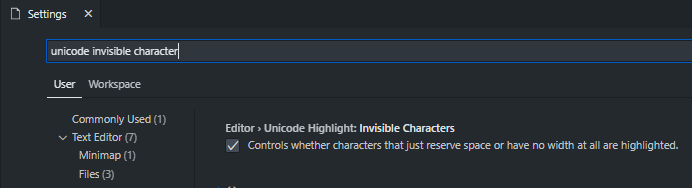
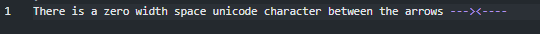
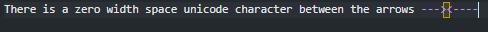
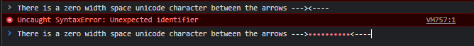

# How To View Zero Width Space Unicode Character


- [How To View Zero Width Space Unicode Character](#how-to-view-zero-width-space-unicode-character)
  - [What is Zero Width Space Unicode Character?](#what-is-zero-width-space-unicode-character)
  - [Steps To view zero width space unicode character in VSCode](#steps-to-view-zero-width-space-unicode-character-in-vscode)
  - [Steps To View Zero Width Space Unicode Character in Chrome](#steps-to-view-zero-width-space-unicode-character-in-chrome)
  - [Reference](#reference)

## What is Zero Width Space Unicode Character?

The zero-width space character is encoded in Unicode as `U+200B` **ZERO WIDTH SPACE**

## Steps To view zero width space unicode character in VSCode

- Go to VSCode Settings by Clicking on File > Preferences > Settings or Pressing `CTRL+,`
- Now using search bar look for `unicode invisible character`
- Now enable the option using checkbox for `Editor > Unicode Highlight: Invisible Characters`
  

OR

Simply add following tag to your VSCode Settings JSON > **Setting ID** : `editor.unicodeHighlight.invisibleCharacters` as `true`

```json
"editor.unicodeHighlight.invisibleCharacters": true
```

After doing so, you will observe following changes in VSCode

**Before** Setting Change



**After** Setting Change



## Steps To View Zero Width Space Unicode Character in Chrome

Just open chrome console and then copy-paste the text you want to check for zero width space unicode character inside it and then press enter key.



As you can see in above image, the zero width space unicode characters get highlighted as `red dots`.

## Reference

- [Wikipedia : Zero Width Space Unicode](https://en.wikipedia.org/wiki/Zero-width_space)
