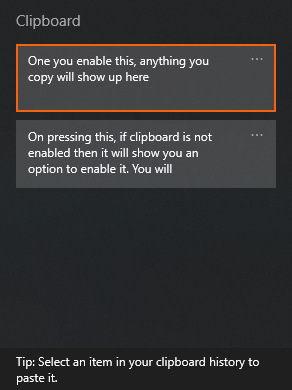

# Windows CMD

- [Windows CMD](#windows-cmd)
  - [Sample Commands](#sample-commands)
    - [Command to list down folders and sub-folders](#command-to-list-down-folders-and-sub-folders)
    - [Command to list down all files and folders and sub-folders](#command-to-list-down-all-files-and-folders-and-sub-folders)
    - [Command to list files with specific extension](#command-to-list-files-with-specific-extension)
  - [`ipconfig` Commands](#ipconfig-commands)
  - [Windows Clipboard](#windows-clipboard)
  - [Snip & Sketch](#snip--sketch)

## Sample Commands

### Command to list down folders and sub-folders

**Command:** `dir /s /b /o:n /ad`

**Command:** `dir /s /b /o:n /ad > folder.txt` Will save output to folder.txt file

### Command to list down all files and folders and sub-folders

**Command:** `dir /s /b /o:gn`

**Command:** `dir /s /b /o:gn > filelist.txt` Will save output to filelist.txt file

### Command to list files with specific extension

| Function                                                 | Command                   |
| -------------------------------------------------------- | ------------------------- |
| List filename with extension in directory                | `dir *.[extension]`       |
| List only the filenames with extension                   | `dir /b *.[extension]`    |
| List files in directory and all sub-directories          | `dir /S *.[extension]`    |
| List only filenames in directory and all sub-directories | `dir /S /b *.[extension]` |

## `ipconfig` Commands

| Function                                                                                                              | Command                |
| --------------------------------------------------------------------------------------------------------------------- | ---------------------- |
| To displays Internet Protocol version 4 (IPv4) and IPv6 addresses, subnet mask, and default gateway for all adapters. | `ipconfig`             |
| To display DNS server settings / all IP configuration information.                                                    | `ipconfig /all`        |
| To display the contents of the DNS resolver cache                                                                     | `ipconfig /displaydns` |

## Windows Clipboard

**Command**: `win key + v`

On pressing above command, if clipboard is not enabled then it will show you an option to enable it. You will have to click on `Turn on`

Once you enable this, anything you copy will show up here

## Snip & Sketch

**Command**: `win key + shift + s`

This will allow you to snip the screenshot and then you can paste it or edit it and save it in `Snip & Sketch`.

